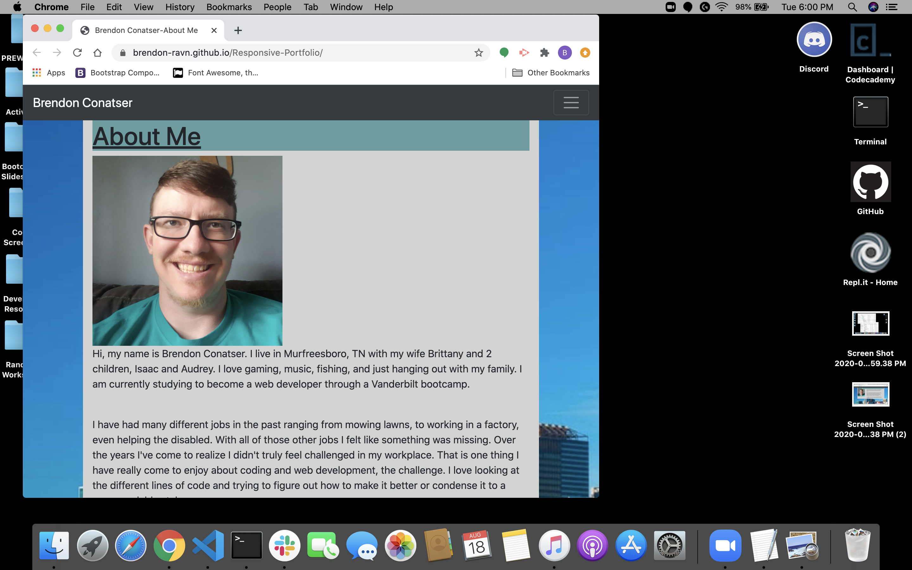
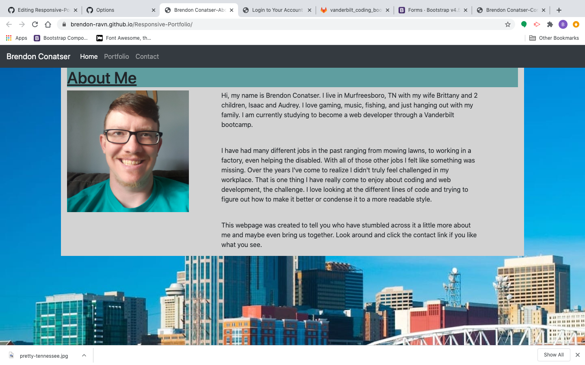

# Responsive-Portfolio

## Description

This was a bootcamp homework assignment to create a mobile responsive portfolio website using Bootstrap.

## Usage

## Installation

repository https://github.com/Brendon-Ravn/Responsive-Portfolio
 
website  https://brendon-ravn.github.io/Responsive-Portfolio/
